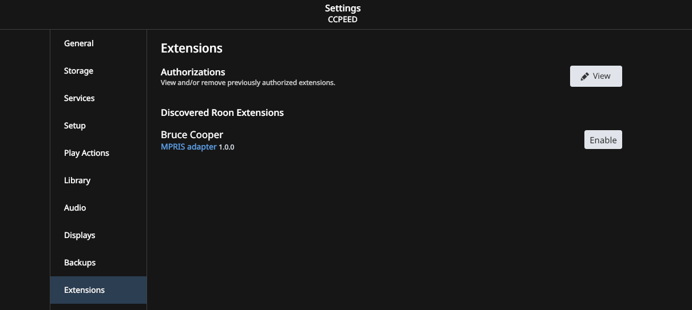

Want to control [Roon](https://roonlabs.com/) from your keyboard on linux?  You can run [Roon on Wine](https://github.com/RoPieee/roon-on-wine) which allows you to select albums to play or whatever, but this does not hook up to the standard media controller buttons (PLAY, PAUSE, NEXT, PREV) used on Ubuntu, [MPRIS](https://www.freedesktop.org/wiki/Specifications/mpris-spec/).  

This little script aims to provide a way to have MPRIS (i.e. your linux box) control Roon's basic functions, like Play, Pause, Next and Previous. That's all it does.

# Installation

1. Install this software
    ```
    npm install -g github:brucejcooper/roon-mpris
    ```
1. run the script from any directory
    ```
    node-mpris
    ```
    Note that this will create a configuration file in `${HOME}/.config/roon-mpris`.
1. In your existing Roon application (phone or desktop) Go to `Roon` -> `Settings` -> `Extensions`.  You should see the "MPRIS adapter" under my name. Enable the Extension

1. Click on "Settings", and select the zone you wish to control from your computer.
1. Success!

## Troubleshooting
the Roon API uses UDP multicast packets to discover Roon cores on the same subnetwork.  Some laptops (like my work one) block these packets, requiring you to connect directly to the host running the core.  Run ```node . --help``` to see the options that allow you to do this.

You can also specify a log level (try `all`) that the API uses to report what is going on.  That might help

# Credits
I based this work off the following packages

* [Roon's API](https://github.com/RoonLabs/node-roon-api)
* [mpris-service](https://github.com/dbusjs/mpris-service)
* [roon-extension-linuxkeyboardremote](https://github.com/naepflin/roon-extension-linuxkeyboardremote) - I used this as a starting point, then added the MPRIS support


# TODO

1. Make this start on system login, possibly with a little icon thingy..
1. Volume Support - Ubuntu uses the volume keys to control its own system volume.  I don't want to subvert that, but it would also be nice to have them control roon volume... not sure what to do here.
1. Remote control support.  This might be more of something for [RoPieee XL](https://ropieee.org/xl/), to allow a BLE remote control to control stuff.
